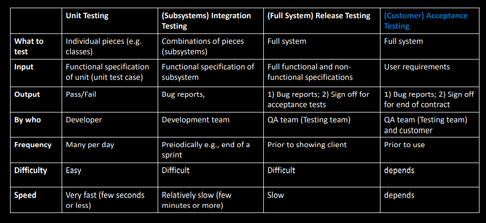
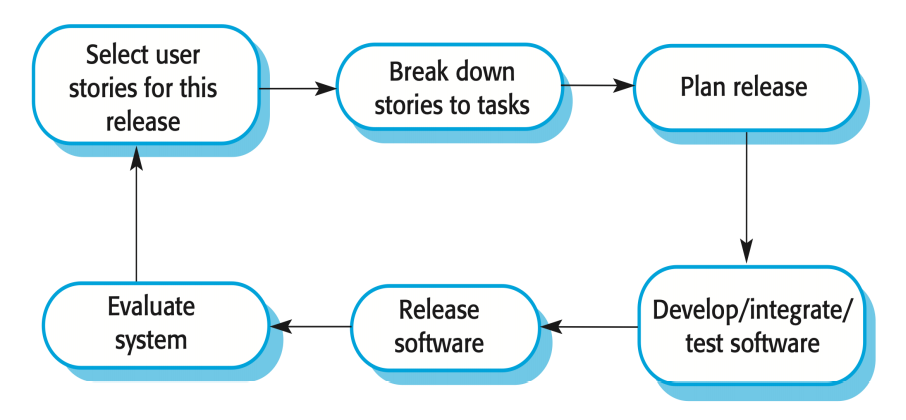
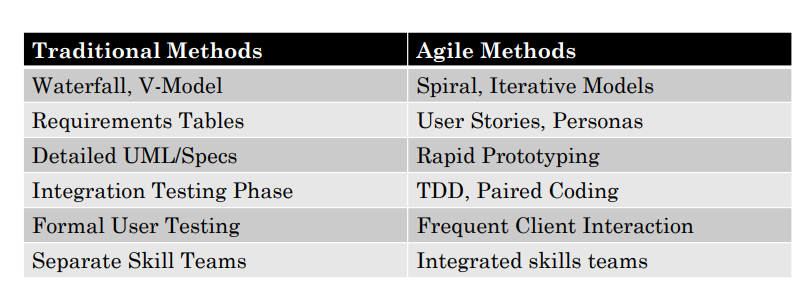

[TOC]

# Lecture 1

## What is software

- The compiled code
- documentation
- configuration components
- installation/upgrade

All in an installer that 'deploys'

## What is software engineering 

The application of a systematic, disciplined, quantifiable approach to the development, operation and maintenance of software.

That is, the application of engineering to software.

## Core SE process stages(4 stages)

- Specification
- development
- validation
- evolution

### Waterfall model(图要记住)

### V-model（图要记住）

#### problems of Waterfall and V

• Needs stable and “perfect” requirements.

• Can’t always anticipate what you are going to have to do.

• Does not account for revision or refactoring.

• Too inflexible and static.

• Depends on getting each stage exactly right

• Changes can have many knock-on effects.

### iterative model

#### problems of iterative 

• Needs stable and “perfect” requirements.

• Can’t always anticipate what you are going to have to do.

• Does not account for revision or refactoring.

• Too inflexible and static.

• Depends on getting each stage exactly right

• Changes can have many knock-on effects.

# Lecture 3

## major problem in  software development

understanding product requirement

## stakeholder

eg. clients, customer, user and other interested parties needs

determine **all the people** 

- primary stakeholders
- secondary
- tertiary

## requirement engineering

In more technical terms its about “requirements engineering” or figuring out what  stakeholder needs and what services a product will need to provide to meet those  needs.

## Requirements Elicitation

第二张右边的小圆圈

## personas

represent **a real type of user** from your stakeholders

### main aim

it should **differentiate** stakeholders clearly

(photo, role, name, demographics, personality elements, key quote, elaborated point of view)

## use case diagram

They represent the people who use the  system and the tasks they must perform.  We call the people “actors”

- extension
- include

## user stories

agile teams

**“As a <role>, I want  <goal/desire> so that <outcome> ”**

A single sentence – to represent single requirement. 

• A role (actor/stakeholder etc.). 

• A goal/function/action/use case. 

• An effect/outcome/motivation – the WHY behind the WHAT.

### pons

•Concise and clear. 

• Very little maintenance.

• Creates a clear requirements  checklist.

• Break project down into chunks.

• Can rank for importance etc.

### cons

• Difficult to use in BIG projects.

• Loose detail and formality.

• Don’t describe process or tasks  or context.

# Lecture 4

## Requirements vs Specifications

functions the **user(stakeholder)** needs to achieve

functions the **software**(must do to meeting the requirement above) will include

### functional vs non-functional

functional: eg. 

- A user should be able to post a new image.
- A user should be able to repost images they like.

non-functional: constraints on .....

### The category of NF requirements

- product requirements（产品需求）
- organizational requirements（环境、操作需求）
- external requirements（安全。道德需求）

## Investigating / Validating  Requirements

### Initial questions/ set investigation goals/choose a technique

## methods

- surveys
- interviews
- focus groups
- observations - allows you to see things people didn't say

### Advanced – Technology Tours/Ethnography

# Lecture 5- Requirements Modelling

## requirements models

synthesising all the requirements you collected into key requirements

## UML

Unified Modeling Language 

### Context models(initial requirements)

Make a decision on the system **boundaries**/ **inter-relate** of systems

##### Activity diagrams

show the  business process within such systems/elaborate workflows  for key /Usually to define one Use Case  **in more detail activities** （可以表示并发）

actions - Rounded rectangles

diamonds - decisions

Bars represent the start (split) or  end (join) of concurrent  activities

black circle - start

encircled black - end

### Interaction models(refined requirements)

Interactions between systems and users, between different systems, within a  specific system

##### Use case modeling

interactions between a **system and external users**

##### Sequence diagrams(architecture design)

interactions between system components.

### Structural models(architecture design)

the organization of a system in terms of the  components that make up the software system and their relationships.

##### Class diagrams

modeling the static structure of the **object classes**. (relationship between class)

### Behavior models

modeling the dynamic behavior of a system as it is executing. How it responds to data input or events

##### Data-driven modeling

The sequence of actions involved in processing input data  and generating associated output. 

##### Non-experts

data flows

##### Experts or engineers

sequence diagrams.  

##### Event-driven modeling

How a system responds to external or internal events? 

##### State diagrams(architecture design)

How an event can trigger system transitions from one to another?

一个对象用不同状态对应不同行为

## Scenarios

a structured description of process

- define a setting
- actors or users
- goals or objectives
- describe a plot
- benefit

# Lecture 5 - Requirements validation

## Requirements / Specifications Documents

### SRS documents

## Requirements Validation

1. check that you are right
2. avoid reworking
3. contractually agreeing

### internal

You present it to your “boss and colleagues

### external

You present it back to participants/clients/users

# Lecture 6 - Specifications

## Specifications vs Requirements

## Specifications

WHAT should be built – but not necessarily HOW

- ### Natural Language

Use a standard format: 1 sentence, linked to a user requirements

eg. 

- ### Structured

Go further than natural language specifications, to tabulate  specifications, or put them in templates.

eg.

- ### Graphical

UML models, diagrams, prototypes. - sequence diagram

## Good Specifications

### 3C princeples

- Clear
- Consistent
- Concise

### Traceability

### Testability

## Specification >> Prototypes

### A prototype combines

- The graphical specifications
- The textual specifications

# Lecture 8 - Prototyping

## What are Prototypes and Why 

A prototype is a **concrete** but **partial representation** or [partial]  implementation of a system

- specifications hard to understand
- is a way of show how all specifications work together

## Low vs High Fidelity

保真度

### Low Fidelity

Thrown away

Produced quickly

Thrown away

### High Fidelity

Built in software for automation

Finalize chosen ideas

## What Are You Prototyping

### 3 types of prototype

1. role of technology - ppt/paper do more
2. look and feel - UI designers do
3. implementation guide

## One Type of High Level Design

## Prototyping Risks

1. invest too much time/energy on high-fidelity prototypes
2. prototype code is re-used in the real system
3. Prototyping is used instead of, rather than alongside,  documentation（不能只有prototype 没有documentation）
4. prototypes might be approved by the wrong stakeholders

## Prototyping Tools

# Lecture 9 - OO Design(Object-Oriented Design) & Test Plans

Architecture design

Interface design

Database design

Component design

## Class description document

adding detail to classes

For each variable and each method/function

## Test plans

- determine when a programmer **finish** building something
- used for **test driven development**

### development test plan(unit testing)

prove the class function correctly

### system/integration test plan(system/integration testing)

prove that the software meets the specs

### acceptance test plan(acceptance testing)

shows that the software meets the requirements

often done with client

## The overall document 

- testing process
- requirements traceability -links between Requirements and Tests

- tested items
- testing schedule
- test recording procedures

- hardware/software requirements
- constraints
- system tests

## Test case

### steps

1. what is being tested
2. input
3. output
4. steps needed to carry out the test

## The types of test plans

validation testing

- given the correct data - get right answer

defect testing

- given the incorrect data - show the software doesn't break

# Lecture 10 -  Implementation & Debug

## Social Dev Perspectives

## Coding Conventions

## Good Practices for Code

## Strategies for Approaching Code

### Test-Driven Development

Before you write code - write the automatic tests it must pass

### Comment-Driven Development

Strategy: Write the comments first  

then you populate the comments with code

### Coding - alongside other people

## Debugging

# Lecture 11 - Test Driven Development (TDD)

white box/black box testing

automated/ manual testing

## Test-Driven Development(Writing unit tests before writing codes)

Then every time you run your code, it auto-runs the tests too

you code work together with running these tests.

### Advantages

- Makes you think about how code is used, before you build it.
- It means you ‘plan’ code before you ‘write’ code.

### Three Laws of TDD

1. You may not write production code until you have written a  failing unit testing. (Create a unit test that fails.)
2. You may not write more of a unit test than it is sufficient  to fail, and not compiling is failing. (Write the unit tests that are  complied and sufficiently good enough.)
3. **refactor** :You may not write more production code than it is  sufficient to pass the currently failing test. (Write the production  codes that pass the unit tests.)

## JUnit

## Good test

- line coverage 
- function coverage 
- condition coverage
- path coverage
- entry/exit coverage

# Lecture 12 - Release testing & Acceptance testing

## Subsystem Integration Test

## Release Testing

Release Testing is testing the whole system works together

• to meet the full Specifications

• including non-functional ones

### Good strategies

1. performance driven 

using performance or stress-testing

Performance testing is particularly useful for distributed systems

eg. Can it handle 1000 user connections?

2. requirement driven

Develop a series of tests that relate to different specifications

3. scenario driven

### Integration vs Release Testing

1. A separate team that has not been involved in the system development  should be responsible for release testing. (Developer Team vs. QA Team)
2. Rather than finding integration bugs, (Integration bugs. Vs. system specifications.)
3. This is validation testing - rather than defect testing Black-box - rather than white-box

## Different tests

## Acceptance Testing

# Lecture 13 - Config & Deployment

## Evolution 

By having a workflow across stages Configuration Management (CM) is concerned with management of evolving systems.

## version control 

keeping track of multiple version

- branch for release
- branch for maintenance
- branch for feature
- branch for team

## Continuous Integration

CI keeps the master branch up-to-date

automating the integration of code changes from multiple contributors into a single software project.

(每commit一次merge一次test一次)

#### Benefits

figure out from the start 

find bugs quickly

## Build configuration

### what is software 

source codes/libraries/data files/configuration files

version of complier and other software tools

## Automatic  Deployment

# Lecture 14 Evolution & Maintenance

## Maintenance involves

correcting

improving 

enhancing

## change is inevitable

## change is expensive

###  Especially if corners were cut at development time 

### why

- team changes
- staff skills
- program age and structure
- poor development practices

## Change management

### 3 types of change 

1. Fault repairs - fix code error(cheap)
2. Environmental adaption - update for new OS(bit more expensive)
3. **Functionality addition** (much more)- meet business changes(more expensive, involves redesign)

#### Requirements Change Management

The process of understanding and controlling change to  Requirements

change implementation - changing the requirements(not coding)

## Refactoring

process of making improvements to a program to **slow down degradation**  through change

eg.

duplicate/similar code

long methods

data clumping

speculative generality 

## Emergency  Changes

### document emergency changes 

documented ready for the next proper change

# Lecture 15 - Agile method

## Process/Project Management

Deliver good quality product 

**Use good reliable methods**

reducing as much risk as possible

plan/budget/manage a project based on these

## Agile

Agile methods exist to be **flexible** about the SE stages

There are times when it’s good to plan - and times when good to be agile.

### Agile Principles

1. Our highest priority is to **satisfy the customer through early and  continuous delivery** of valuable software.
2. Welcome changing requirements, even late in development. Agile  processes **harness change for the customer's competitive  advantage**.

3. **Deliver working software frequently**, from a couple of weeks  to a couple of months, with a **preference to the shorter  timescale**

4. Business people and developers must **work together** daily throughout the project.

5. Build projects around motivated individuals. Give them the  environment and **support they need**, and trust them to get the  job done.

6. The most efficient and effective method of conveying information  to and within a development team is **face-to-face conversation.**
7. **Working software** is the primary measure of progress

8. Agile processes promote **sustainable development**. The  sponsors, developers, and users should be able to maintain a  constant pace indefinitely
9. **Continuous attention** to technical excellence and good design  enhances agility
10. **Simplicity** — the art of maximizing the amount of work not done  — is essential
11. The best architectures, requirements, and designs emerge from  **self-organizing teams**.
12. At regular intervals, **the team reflects on how to become  more effective**, then tunes and adjusts its behavior accordingly

## How to do Agile

### agile requirements

### agile design

### agile implementation

## Scrum vs Kanban vs XP

### Scrum - optimising by: time and delivery(popular one)

A lightweight framework that helps people, teams and organizations  generate value through adaptive solutions for complex problems

#### 3 roles

- ScrumMaster -  the keeper of the scrum process
- Product Owner - the sole person responsible for managing the Product Backlog
- Team

#### Scrum events

Sprint

Daliy scrum meeting

sprint review

sprint retrospective

#### Scrum artifact

product backlog

sprint backlog

increment

### Kanban - speed of delivery

what shall we build next

All features to build are kept in a list

### XP(extreme programming) - team effectiveness

XP is a fast ‘extreme’ approach to iterative development

incremental planning

small release

simple design

test-first development

refactoring

pair programming

collective ownership

continuous integration

sustainable pace

on-site customer

#### Customer collaboration

#### Working software

#### Individuals and interactions

#### Responding to Change

## Agile vs Traditional - Comparison

pros cons

#### It’s not Agile or Plan - overall 

#### It’s Agile or Plan - for each stage »Overall, you might mix things

# Lecture 16 - Software Quality

## Process/Project Management

**Deliver good quality product** 

Use good reliable methods

reducing as much risk as possible

plan/budget/manage a project based on these

## Software Quality Management

### Software Quality

doing every aspect well

All SE Processes are designed to improve software quality

#### QA Teams (Quality Assurance) - 3 things

##### planning

product introduction

product plans

process description

quality goals

risk & risk management

###### SE Process

 A software engineering process is the model chosen for managing  the creation of software from initial customer inception to the release  of the finished product

Aim: to improve the QA standards in the company

##### defining 

product/process standards

##### check

##### ing

a) Identifying points for inspections 

###### Fagan Inspections

More Specific Roles

focusing on finding, not solving, problems

###### Agile Retrospectives

after each sprint

for the same project

###### Agile Postmortems

end of project

for future projects

b) Identifying relevant measures

###### Code/Predictor Measures - Metrics

eg. number of lines of code

###### Control/Process Measures

eg. numer of person days for coding

Metrics can only be used as predictors

# Lecture 17 - Risk Management

## Process/Project Management

Deliver good quality product 

Use good reliable methods

**reducing as much risk as possible**

plan/budget/manage a project based on these

## Risks, Opportunities, and Problems

### Risk

A risk is the probability of unwanted consequences of an event and  decision

A risk  is the probability of **failing to** meet expectations

A risk is a potential problem over which we  have some choice

### Opportunity

An opportunity is the probability of **exceeding expectations**.

## Software Risks

### Shall-not Requirements

Functional Requirements

- what should not happen 
- what should happen for non-correct usage or errors

Non-functional Requirements  

- define the reliability and availability of software

#### Risk identification

- Interviewing/Brainstorming

- Voluntary Reporting

- Decomposition

  Every TBD ("To Be Done/Determined") is a potential risk

- Critical Path Analysis

- Assumption Analysis

- Risk Taxonomies

#### Risk Decomposition

 Sometimes best solution to solve a problem - is not the ‘best for that problem’ - but the best for all related problems

#### Risk Reduction

hazard avoidance

hazard detection & removal 

damage limitation

### Non-functional Risks

loss of service

incorrect service delivery 

system/data corruption

#### Availability Measures

0.99 - the system is available for 90% of the time

### Risk-based Release Tests

Your test plan (for release or acceptance tests) might be driven by  these

### Risk Analysis at 3 Project Stages

preliminary risk analysis

lifecycle risk analysis

operational risk analysis

## Project Risks

### What causes failure

requirements specifications

maintenance

### Recognizing and Controlling Risk

Risk Review Board

### Risk types

- Technology
- people
- organizational
- tools
- requirements
- estimation
- staff turnover
- management change

### Risk Prioritisation

### Risk Planning

Avoidance strategies - defective components

Minimization strategies - staff illness

Contingency plans - underestimated development time

### Risk Strategies

### Risk Monitoring

## Risk Management Plan

## Risk Management Common Practices

# Lecture 18 - Project Planning

## Process/Project Management

Deliver good quality product 

Use good reliable methods

reducing as much risk as possible

**plan/budget/manage a project based on these**

## Project Plans

### Project Scheduling

measurable outcomes

### Milestones and Outputs

## Planning Diagrams

### PERT

The longest path (worst case) is the critical path(Bottleneck Route)

### Critical Path Method

### Gantt Chart

### Staff Allocation Charts

### Agile Planning

Set deadlines - the output is always ‘working’ software +  something

## Estimating Cost & Budget

### 2 approaches

by work that needs doing

by developer time

### Cost estimation

#### Experience-based techniques

#### Algorithmic Cost Modelling

Effort = A * Size^B * M

A - a constant based on organization overheads

Size - A Size estimate on code, or amount of functionality

B - size of project, likelihood of overrun - B is bigger for larger projects (1

M - a multiplier for product/process/people attributes - i.e., a project needing more rigorous process for safety

##### COCOMO

An empirical independent model based on project experience